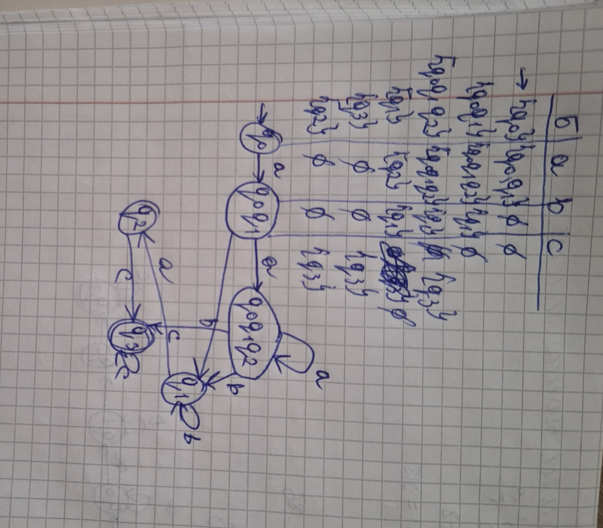
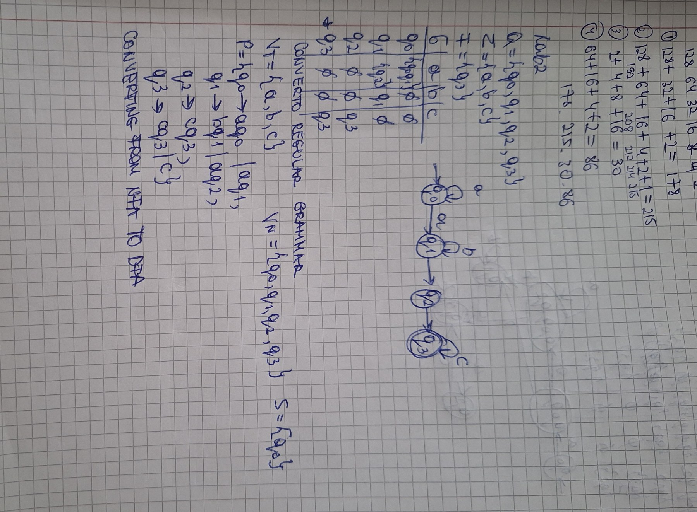

# Determinism in Finite Automata and Grammar Classification

## Theoretical Part

In the study of formal languages and finite automata, several key concepts come into play, such as determinism in finite automata, the process of converting a nondeterministic finite automaton to a deterministic one, and the classification of grammars according to the Chomsky hierarchy. This discussion pertains to a course on formal languages and finite automata, authored by Tatrintev Denis from the FAF-232 group. The theoretical foundation begins with the Chomsky classification, which organizes grammars into four distinct types. Type 0, known as recursively enumerable grammar, imposes no limitations on its production rules, allowing transformations like "alpha" turning into "beta." 
Type 1 encompasses context-sensitive grammars, where productions take the shape of "a1 A a2" transforming into "a1 Beta2," with "a1" and "a2" being strings from a combined set of non-terminal and terminal symbols, "Beta" being a non-empty string from the same set, and "A" belonging to the non-terminal symbols. This type further splits into left-context-sensitive grammars, where "a1 A" becomes "a1 Beta," and right-context-sensitive grammars, where "A a2" turns into "Beta2." 
Type 2, or context-free grammars, requires all productions to follow the pattern of "A" transforming into "Beta," with "A" as a non-terminal and "Beta" as a string from the union of non-terminal and terminal symbols. Finally, 
Type 3, the most constrained, is the regular grammar, which can be expressed in two forms: right linear grammar, where "A" becomes "a B" or just "a," with "a" as a terminal and "A" and "B" as non-terminals, and left linear grammar, where "A" transforms into "b A" or "a," adhering to similar constraints.

Finite automata are another critical aspect of this study. A deterministic finite automaton is defined as a five-element structure consisting of a finite set of states, an input alphabet, a transition function mapping a state and an input symbol to a new state, an initial state from the set of states, and a subset of states designated as accepting or final states. In contrast, an ε-nondeterministic finite automaton shares a similar five-element structure but allows its transition function to map a state and either an input symbol or the empty string "ε" to a set of possible states, permitting ε-transitions and multiple state outcomes. Finite automata, in essence, act as straightforward mechanisms that process sequences of inputs like letters or numbers according to predefined rules, determining their validity.

## Objectives

The objectives of this exploration include understanding the nature and utility of automata, as well as extending prior work in a shared repository and project. This involves adding a function to a grammar type or class to classify it within the Chomsky hierarchy, potentially reusing a variant from a previous lab. Based on a variant number tied to a register ID, one must define a finite automaton and perform tasks like converting it to a regular grammar, determining if it is deterministic or nondeterministic, implementing a method to transform a nondeterministic finite automaton into a deterministic one, and optionally depicting the automaton graphically for bonus consideration, possibly using external libraries, tools, or APIs to create visual representations while ensuring the program collects and submits the necessary data for the depiction.

##Variant 26
Variant 26
Q = {q0,q1,q2,q3},
∑ = {a,b,c},
F = {q3},
δ(q0,a) = q1,
δ(q1,b) = q1,
δ(q1,a) = q2,
δ(q0,a) = q0,
δ(q2,c) = q3,
δ(q3,c) = q3 

## Implementation Description

For a specific variant, Variant 26, the finite automaton is defined with a set of states including q0, q1, q2, and q3, an alphabet of "a," "b," and "c," a final state of q3, and transitions such as q0 moving to q1 with "a," q1 staying at q1 with "b," q1 moving to q2 with "a," q0 staying at q0 with "a," q2 moving to q3 with "c," and q3 staying at q3 with "c." The implementation details reveal a code segment from a Grammar.cs file that checks the Chomsky type of a grammar from a prior lab, utilizing functions like GetChomskyType, which returns a number corresponding to the grammar type after verification through specific IsType functions. These functions assess whether the grammar fits Type 3, Type 2, or Type 1, with Type 0 being any grammar not perfectly matching the previous three. For instance, the verification for Type 2, context-free grammar, ensures all productions follow the form "A" to "alpha," where "alpha" is any mix of terminals and non-terminals, checking that the left side contains only non-terminals and disregarding the right side’s specifics beyond that requirement. A Program2.cs class then outputs these findings by creating a grammar object, calling the classification methods, and printing results based on a switch statement identifying the grammar as regular, context-free, context-sensitive, or unrestricted.

The complete implementation of Task 3 starts with converting the finite automaton to a regular grammar, following an algorithm where the non-terminals equal the states, terminals equal the alphabet, the start symbol is the initial state, and productions are built by initializing an empty set and adding rules based on transitions, such as "q" to "a qi" for each possible next state, and "q" to "a" if a final state is reachable. The next step identifies the automaton as nondeterministic due to q0 transitioning to both q0 and q1 with "a." The conversion from nondeterministic to deterministic form involves an analytical approach starting with the initial state, building a new state set, defining transitions by uniting outcomes for each input across combined states, iteratively expanding the state set until no further changes occur, and setting final states as those containing any original final states. Alternatively, a table-based method constructs state tables for both automata, marks the start state, computes combined state transitions for each input, and repeats until all states are defined, with final states including any original final states.

'''csharp
 private bool IsType3()
    {
        foreach (var rule in P)
        {
            foreach (var production in rule.Value)
            {
                bool singleTerminal = production.Length == 1 && VT.Contains(production[0]);
                bool terminalNonTerminal = production.Length == 2 && VT.Contains(production[0]) && VN.Contains(production[1]);
                if (!(singleTerminal || terminalNonTerminal)) return false;
            }
        }
        return true;
    }

    private bool IsType2()
    {
        return P.Keys.All(nonTerminal => VN.Contains(nonTerminal));
    }

    private bool IsType1()
    {
        foreach (var rule in P)
        {
            foreach (var production in rule.Value)
            {
                if (production.Length < rule.Key.ToString().Length)
                    return false;
            }
        }
        return true;
    }

'''
These functions assess whether the grammar fits Type 3, Type 2, or Type 1, with Type 0 being any grammar not perfectly matching the previous three. For instance, the IsType3 function checks if productions are either a single terminal or a terminal followed by a non-terminal, adhering to the rules of regular grammars. The IsType2 function verifies that all left-hand sides of productions are non-terminals, fitting the context-free grammar definition. The IsType1 function ensures that the right-hand side of each production is at least as long as the left-hand side, aligning with context-sensitive grammar constraints. A Program2.cs class then outputs these findings by creating a grammar object, calling the classification methods, and printing results based on a switch statement identifying the grammar as regular, context-free, context-sensitive, or unrestricted.
## Results

The output confirms a Type 3 regular grammar classification based on the implemented grammar classification function. Below, you can insert screenshots to illustrate the results of the grammar classification and finite automaton conversions as obtained from your program execution.

## Conclusion

In conclusion, this work delves into implementing and analyzing fundamental concepts of formal language theory, focusing on grammars and finite automata. The second task successfully developed a method to classify a grammar’s Chomsky type by examining production rule structures, distinguishing between unrestricted, context-sensitive, context-free, and regular grammars. The third task, planned for future execution, involves converting finite automata to regular grammars, assessing determinism, transforming nondeterministic automata to deterministic ones, and optionally visualizing automata graphically. These efforts solidify the equivalence between nondeterministic and deterministic automata, enhance comprehension through visuals, and provide practical experience with formal language principles, establishing a robust basis for computational manipulation of such languages.
